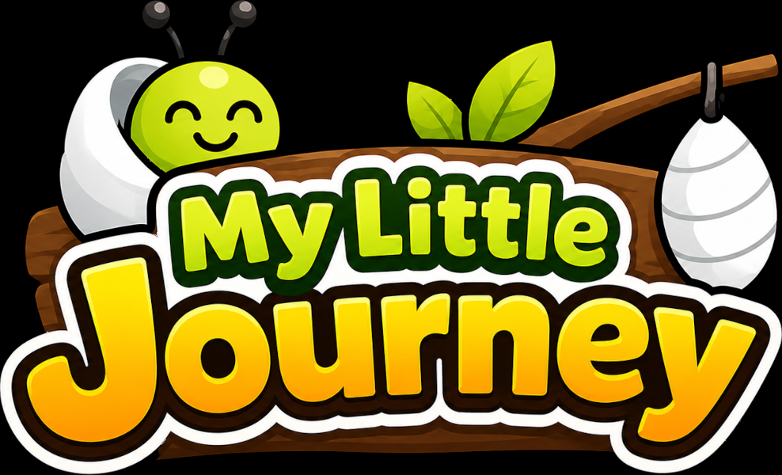

  

  # My Little Journey

  **A playable sensory journey made for babies and the people who love them.**

My Little Journey lives somewhere between a gentle video and a simple game.
Bright characters move through a colorful, continuously changing world filled
with music, motion, matching, collecting, and small surprises.

Babies can watch the journey unfold like an animated sensory experience. When
the controller is left alone, gentle AI-assisted autoplay takes over and keeps
the adventure moving. Parents, grandparents, and older brothers or sisters can
pick up the controller at any time, play along, and turn screen time into time
shared together.

There are no instructions to read, no complicated menus, and no pressure to
play perfectly. Just move, explore, and enjoy the journey.

## A little life, one big journey

The adventure begins with a hungry caterpillar in the grass. As the journey
continues, familiar friends transform and lead one another into new places:

- Guide a caterpillar toward colorful fruit and watch it grow.
- Help a butterfly remember and match hidden flower colors.
- Fly with a bee through a lively garden of drifting flowers.
- Swim as a growing fish, enjoying food while avoiding sinking trash.
- Cross the river with a frog, hopping between moving lily pads and gathering
  lotus flowers.
- Discover a playful dog-and-bunny bonus along the way.

Each part introduces a different kind of gentle challenge—tracking movement,
recognizing colors, remembering positions, anticipating paths, and learning
cause and effect. The transitions connect every stage into one long visual
story rather than a collection of separate mini-games.

## Made to watch, made to share

My Little Journey can be enjoyed in several ways:

### Watch mode

With a caregiver nearby, let the built-in player guide the characters. The large
sprites, contrasting colors, calm music, and smooth movement create a sensory
experience that does not require constant controller input.

### Play together

An adult or older sibling can control the characters while a baby watches,
points, reacts, and begins to anticipate what will happen next. Name the colors,
count the fruit, follow the flowers, or celebrate each successful jump
together.

### Take turns

Anyone can take control simply by pressing a direction. If the controller is
left alone for a while, the built-in player resumes the journey automatically.
There is no need to pause or change modes.

## How to play

Use a television remote, game controller, keyboard, or touchscreen.

| Input | Action |
| --- | --- |
| Directional pad or analog stick | Move, swim, fly, or choose a jump direction |
| Select, Enter, Space, or controller A | Flap or perform the character's main action |
| Touchscreen swipe | Move in the swiped direction |
| Touchscreen tap | Perform the main action |
| Back | Leave the game |

The controls remain intentionally small and consistent. Different characters
move differently, but the same few inputs carry the family through the entire
journey.

## Designed for little eyes

- Large, friendly characters
- Strong visual contrast
- Smooth animations without flashing effects
- Gentle, continuous music
- Simple cause-and-effect interactions
- Minimal text and no reading requirement
- Automatic assistance when nobody is playing
- No scores competing for attention
- No ads, in-app purchases, accounts, or online distractions
- No personal data collection

My Little Journey is not intended to replace active play, conversation, or time
with family. It is designed to make the moments when a screen is used calmer,
more playful, and easier to share.

## A thoughtful note about screen time

My Little Journey was designed to make screen time gentler and easier to share,
but even calm, carefully made media cannot replace the experiences babies need
most: face-to-face interaction, conversation, movement, sleep, reading, and
hands-on exploration.

The American Academy of Pediatrics notes that infants under 18 months learn best
through real-world interactions. Prolonged or heavy solo screen use can crowd
out important opportunities to develop language, thinking, movement, social
skills, patience, and self-control, and may also interfere with healthy sleep.

If you choose to share this journey with a baby:

- Keep viewing brief and stay nearby rather than using the game as a babysitter.
- Play together: name the animals and colors, count objects, sing, point, and
  respond to the baby's reactions.
- Let the game inspire something away from the screen, such as moving like the
  animals, finding colors, reading a story, or exploring outside.
- Avoid making a screen the primary way to calm crying, encourage eating, or
  help a baby fall asleep.
- Stop or take a break if the baby turns away, becomes fussy, seems tired, or
  appears overwhelmed.

Autoplay exists to keep the story flowing when nobody is holding the controller;
it is not an invitation for prolonged or unattended viewing. Every child and
family is different, so parents and caregivers should use their judgment and
consult their pediatrician when they have questions about media use or
development.

For additional guidance, see the American Academy of Pediatrics resources on
[helping children thrive in a digital world](https://www.healthychildren.org/English/family-life/Media/Pages/helping-kids-thrive-in-a-digital-world-AAP-policy-explained.aspx)
and the [5 C's of media use for infants](https://www.healthychildren.org/English/family-life/Media/Pages/infants-and-screen-time-5-cs-questions-to-ask.aspx).

## There is more than meets the eye

Curious players may notice that the world remembers certain choices. A repeated
action, an unusual collectible, or a particularly adventurous route can change
what happens later in the journey.

Nothing secret is required to enjoy or finish the game. The discoveries are
there for families who like to experiment, pay attention, and wonder:
*“What happens if we try that again?”*

## A journey that comes full circle

The story is designed to flow from one character to the next, with each friend
helping introduce the one who follows. Families who stay with the journey may
find that its ending is also a new beginning.

Take the controller—or simply get comfortable—and begin **My Little Journey**.

## Support

If you have questions, need help, want to report a bug, or have suggestions for future updates, we'd love to hear from you.

📧 Email: contact.mylittlejourney@gmail.com

When contacting support, please include, if possible:

- The device you are using (for example, iPhone, iPad, Android tablet, or Google TV)
- The operating system version (iOS, iPadOS, Android, or Google TV)
- A brief description of the issue, along with the steps to reproduce it (if applicable)

I aim to respond as quickly as possible and appreciate your feedback.
